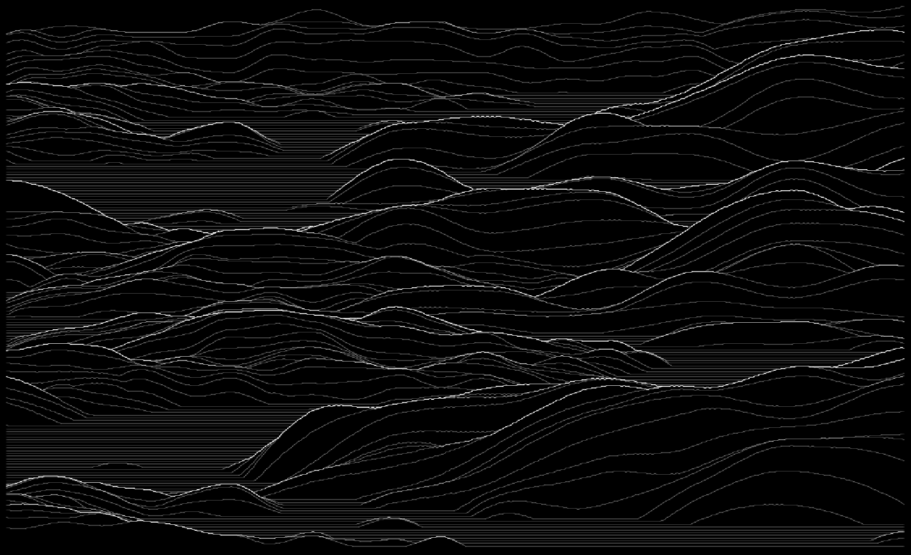
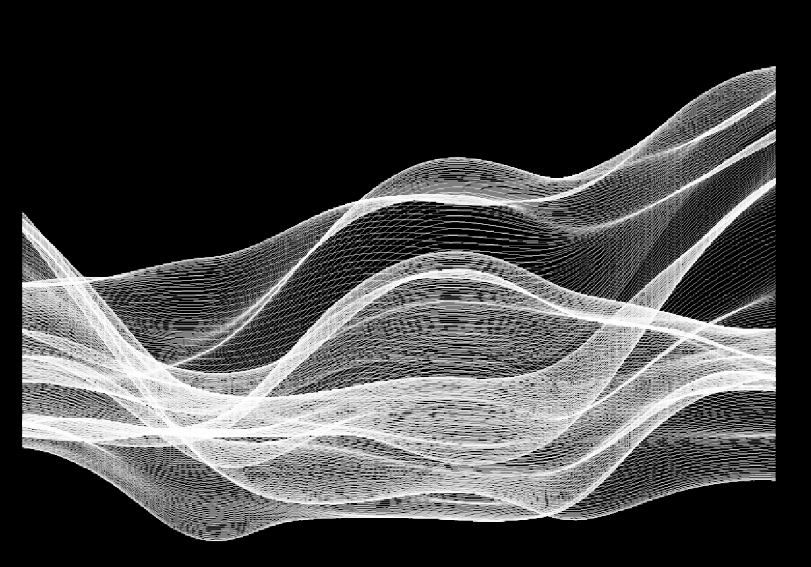
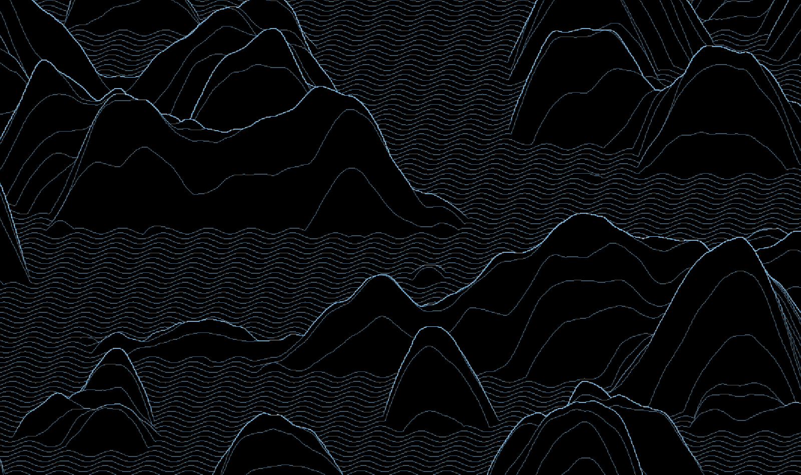
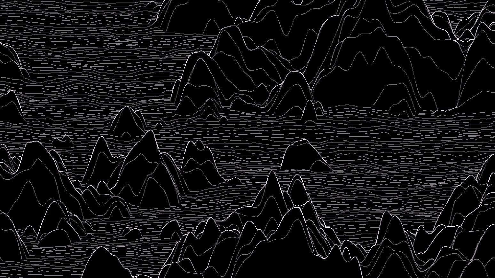

# perlin_mountains

Processing sketch that generates **layered Perlin noise landscapes** — plotter-ready line drawings of mountains, waves, smoke, hair, and more.

---

## Getting a Release

No Processing, Java, or ControlP5 installation is required to run a release build — everything needed is bundled in the zip.

1. Download the release zip (see `releases/` or wherever it was shared with you).
2. Unzip it anywhere.
3. Run the `.exe` inside — that's it.

---

## Examples

### Mountains — default preset

**Main:** `NbLines=174` · `XSteps=376` · `Height=0.53` · `intersection=true` · `max_override=5` · `NoiseLod=5` · `NoiseFalloff=0.62`  
**Layer 0:** global Perlin · max blend · `xPeriod=1.33` · `yPeriod=13.6` · `amplitude=0.23`  
**Layer 1:** global Perlin · max blend · `xPeriod=0.57` · `yPeriod=9.6` · `amplitude=0.72`  
Black background, white lines.

---

### Joy Division 2

**Main:** `NbLines=214` · `XSteps=915` · `Height=1.66` · `intersection=true` · `max_override=3` · `NoiseLod=5` · `NoiseFalloff=0.62`  
**Layer 0:** local Perlin · add blend · `xPeriod=5.17` · `yPeriod=200` · `amplitude=0.074` · `NoiseFalloff=0.78`  
**Layer 1:** gaussian · multiply blend · `xPeriod=5.47` · `amplitude=0.001`  
Black background, white lines.

---

### Blue Wave

**Main:** `NbLines=393` · `XSteps=310` · `Height=0.087` · `intersection=false` · `NoiseLod=2` · `NoiseFalloff=0.67`  
**Layer 0:** local Perlin · add blend · `xPeriod=1.1` · `yPeriod=18` · `amplitude=0.9` · `NoiseFalloff=0.53`  
**Layer 1:** global Perlin · add blend · `xPeriod=5.07` · `yPeriod=15.3` · `amplitude=0.207`  
White background, blue lines (RGB 33, 97, 140). No hidden-line removal — dense wave texture.

---

### Dense White Smoke

**Main:** `NbLines=766` · `XSteps=1281` · `Height=0.28` · `intersection=false` · `NoiseLod=2` · `NoiseFalloff=0.67`  
**Layer 0:** global Perlin · add blend · `xPeriod=4.0` · `yPeriod=30` · `amplitude=0.193`  
**Layer 1:** global Perlin · add blend · `xPeriod=2.67` · `yPeriod=7.5` · `amplitude=0.393`  
Black background, white lines. Very high line count — dense, flowing smoke texture.

---

### Sin Waves

**Main:** `NbLines=130` · `XSteps=1128` · `Height=0.56` · `intersection=true` · `max_override=50` · `NoiseLod=6` · `NoiseFalloff=0.62`  
**Layer 0:** local Perlin · add blend · `xPeriod=7.33` · `yPeriod=40` · `amplitude=0.71` · `NoiseFalloff=0.29`  
**Layer 1:** sinus · max blend · `xPeriod=166.7` · `yPeriod=1520` · `amplitude=0.005`  
Black background, white lines. Very high `max_override` — lines freely overlap, sinus modulation on top of Perlin base.

---

### Rocks & Waves — Large

**Main:** `NbLines=147` · `XSteps=1980` · `Height=0.58` · `intersection=true` · `max_override=5` · `NoiseLod=5` · `NoiseFalloff=0.62`  
**Layer 1:** global Perlin · add blend · `xPeriod=3.33` · `yPeriod=13.6` · `amplitude=0.66`  
**Layer 2:** global Perlin · max blend · `xPeriod=7.5` · `yPeriod=18.5` · `amplitude=0.026`  
Black background, off-white lines (RGB 235, 222, 240). High X resolution — smooth ridges with fine wave detail.

---

## Main Parameters

| Parameter | Role |
|-----------|------|
| `Width` | Canvas width in pixels |
| `NbLines` | Number of horizontal lines |
| `XSteps` | Number of points sampled per line (horizontal resolution) |
| `HeightRatio` | Vertical spread of the lines relative to canvas width (shown as `Height` in the examples above) |
| `intersection` | Enable hidden-line removal (front lines occlude back lines) |
| `max_override` | Max consecutive suppressed points before a segment is cut |
| `seed` | Random seed (randomise button available) |
| `NoiseLod` | Number of Perlin octaves (harmonics) for the global noise |
| `NoiseFalloff` | Amplitude falloff between octaves (0–1) |
| `moveSpeed_X/Y` | Mouse drag sensitivity for panning noise layers |

### Mouse drag navigation

Dragging the mouse pans through the noise space — the behaviour depends on which tab is active:

- **Main tab**: drags all layers simultaneously, moving the entire composition through the noise field.
- **Layer tab**: drags only that layer's `pos_x` / `pos_y`, letting you fine-tune the local noise offset independently from the others.

`moveSpeed_X/Y` controls how fast the pan responds to mouse movement (lower = more precise).

---

## Layers

Up to N independent noise layers can be stacked. Each layer has its own parameters:

| Parameter | Role |
|-----------|------|
| `on` | Enable/disable this layer |
| `line_mode` | Noise function: `0` global Perlin, `1` local Perlin (own seed), `2` sinus, `3` gaussian |
| `layer_mode` | Blend mode: `0` max (override), `1` add, `2` multiply |
| `xPeriod` / `yPeriod` | Horizontal / vertical frequency of the noise |
| `xPeriod_Mul` / `yPeriod_Mul` | Exponent multiplier for period (×10^n) |
| `Height_Noise` | Amplitude of this layer's displacement |
| `Height_Mul` | Exponent multiplier for amplitude (×10^n, can be negative to invert) |
| `Base_Height` | Vertical offset applied to this layer |
| `pos_x` / `pos_y` | Noise origin — pan with mouse drag |
| `NoiseLod` / `NoiseFalloff` | Per-layer octave settings (for local noise mode) |

### Layer blend modes

- **Max** (`layer_mode=0`): keeps the highest displacement between this layer and the accumulated result — useful for mountain peaks.
- **Add** (`layer_mode=1`): sums this layer on top of the previous result — useful for adding fine detail.
- **Multiply** (`layer_mode=2`): modulates the existing displacement — useful for masking or envelope shaping.

---

## Usage Tips

- Start with **2 layers**: one for large-scale shape (low frequency, high amplitude) and one for fine texture (high frequency, low amplitude).
- `layer_mode=0` (max) on the first layer creates clean mountain silhouettes; `layer_mode=1` (add) on subsequent layers adds surface detail.
- **Negative `Height_Mul`** inverts the displacement — useful to flip valleys into peaks.
- `intersection=true` + `max_override=3–8` gives the classic Joy Division / mountain ridge look.
- Mouse drag pans the noise in real time — find a pleasing composition, then save.
- **Smoke/hair presets**: use many lines (`NbLines` > 300), small `Height`, and a high-frequency layer with `layer_mode=1`.

---

For the algorithm details, file architecture, and how to build a release yourself, see [DEVELOPMENT.md](DEVELOPMENT.md).

---

## Changelog

### 2026-08-19 — xLib 3.13.4
- **Load / Save**: no longer opens a separate OS file-picker window (which could occasionally open hidden behind the main window) — replaced by an in-app file browser in the **Files** tab. Particularly relevant here since presets are organised into `Settings/mountains/`, `Settings/hairs/`, and `Settings/smoke_waves/` subfolders: Load and "Save as..." show buttons for every file and folder, with a `..` button to go up a level and Prev/Next if there are many entries. Saving over an existing file asks for confirmation first; saving under a new name uses a text field pre-filled with the current file's name.
- **`export_app.ps1`**: new build script — exports the sketch as a standalone application (embeds a JRE and all libraries, including ControlP5), copies `Settings/` into the export (not included by `processing-java --export`, and required at startup), and zips the result into `releases/` as a ready-to-share release. Same script copied verbatim across projects, same convention as the shared `xLib_*.pde` files.
- **README**: added a "Getting a Release" section (download, unzip, run) at the top; split implementation/algorithm details and the build procedure out into a new [DEVELOPMENT.md](DEVELOPMENT.md); fixed a stale `Main Parameters` table (missing `Width`, `Height` renamed from the actual `HeightRatio` field) and removed a reference to a `DrawingGenerator.pde` file that no longer exists.
- **`.gitignore`**: ignore `build_*/` and `releases/` (generated build output).

### 2026-05-10
- **README**: initial documentation.
- **Fix**: corrections following xLib and Processing update (`xLib_Image.draw()` signature change).

### 2026-05-04
- File tab moved to first position.

### 2026-04-17 — xLib 2.2.11
- SVG and PDF export now use page-adapted dimensions.

### 2026-04-13 — xLib 2.2.9
- Simplified Polyline hierarchy (`SegmentedPolyline` removed).
- Clipping unified into `clipLineToCenteredRect()` across all 3 projects.

### 2026-04-13 — xLib 2.2.7
- `PerlinLine` introduced to clarify type hierarchy.
- Lazy-update mechanism via `data.any_change()`.

### 2026-04-13 — xLib 2.2.6
- Generic `Polyline` abstraction extracted into `xLib_Polyline`.

### 2026-03-27
- Updated to latest xLib; settings sorted by type.

### 2026-01-06
- **Gaussian mode** added (`line_mode=3`): gaussian bell curve displacement.
- **Joy Division** preset added.

### 2026-01-05
- **Recenter** button added.
- `layer_mode` introduced (max / add / multiply blend modes).
- `Base_Height` renamed from `Added_Height`.

### 2026-01-04
- **Local noise** mode added (`line_mode=1`): each layer has its own independent Perlin seed.
- `xPeriod` renamed from `xNoise`.

### 2025-06-16
- Mouse **drag** to pan noise layers in real time.
- Key moves renamed and stabilised.

### 2025-05-15
- Major cleanup; xLib updated.

### 2024-07-16
- Updated from `my_processing` shared library.

### 2021-02-14
- First commit (ported from older project).
